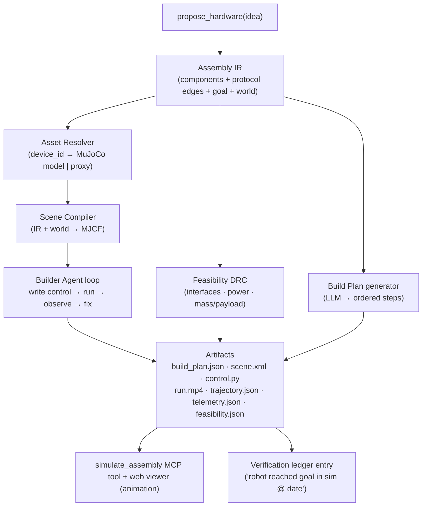

# V2: Assembly Simulation Layer — Implementation Plan

> Take a HackShop proposal → (1) produce a structured **assembly build plan** (the steps:
> solder, program, glue, connect), (2) run a **feasibility check** ("could this robot
> actually work?"), and (3) **simulate the assembled robot operating and navigating in a
> physics world** with watchable animation — so you can see it succeed, stumble, get stuck,
> or do weird things. The "builder" is an **LLM agent that authors the simulation + control
> program**, not a humanoid. No assembly is visualized.

Status: PLAN. No code yet. This doc is the contract to build against.

---

## 1. Decisions locked

| Decision | Choice | Rationale |
|---|---|---|
| What is the "robotic builder" | **LLM agent that authors the MuJoCo scene + control program, runs it, observes telemetry, and self-corrects.** No humanoid embodiment. No visualization of the assembly act. | The substance is "does the proposed robot work," not watching it get built. |
| Assembly representation | **Structured build steps** (solder / flash / glue / connect / mount / calibrate / test). Text + typed data, NOT physically simulated. | User: "enough to know the steps of assembly." Physical assembly sim is frontier and off-goal. |
| What we simulate | **The assembled robot's feasibility + behavior in a world** (navigation, locomotion, sense-act). | User: "what we are testing is the assembled robot's feasibility and navigation in the world." |
| Animation | **Required.** Rendered mp4 first; interactive trajectory scrubber later. Must show failure modes (stuck, tip-over, drift, collision). | User: "I want to see the animations... if the robot stumbles or gets stuck or does weird things we want to see that." |
| Physics engine | **MuJoCo** (CPU for v1 single rollouts; **MJX**/JAX reserved for batched/learned-policy phases). | Matches catalog stack (LeRobot/SO-ARM cite MuJoCo); best contact dynamics; offscreen render → mp4; WASM viewer for web. |
| First vertical slice | **Diff-drive mobile base navigating an obstacle world to a goal** (recommended; see §7). Legged "stumble" drama deferred to Phase 3. | Wheeled control is authorable by the agent from scratch; "stuck/weird" failures are visible immediately. Legged locomotion needs pretrained policies. |

---

## 2. Why two simulators, not one

Physics is the **wrong** tool for half the catalog. An e-paper calendar has no dynamics; its
"does it work" question is *dataflow over the protocol graph*. So the system reasons in two
layers, and only the robots that move hit the physics engine:

- **Physical sim (MuJoCo):** robots that move — wheeled bases, arms, quadrupeds, drones.
- **Feasibility/logical layer (static + optional dataflow):** interface compatibility, power
  budget, mass/payload, and (later) message flow over the protocol edges. This is what makes
  "could it actually work?" answerable for *every* assembly, including non-robots.

Brick-risk discipline carries over: where data is missing we say **"unknown,"** never fabricate
a clean pass. Same philosophy as `src/safety.ts` and `docs/v1-roadmap.md`.

---

## 3. Pipeline



---

## 4. Components

### 4.1 Assembly IR (Phase 0) — the linchpin
Source of truth in TypeScript/Zod (`site/lib/assembly.ts`), mirrored in pydantic in the sim
worker. Today proposals are loose markdown; this makes them machine-consumable. The protocol
graph already exists implicitly in the diagram prompt (`site/app/api/diagram/route.ts`) — promote
it to structured output.

```ts
// site/lib/assembly.ts
export const AssemblyComponent = z.object({
  device_id: z.string(),                 // links to catalog / premium-catalog
  role: z.enum(["compute","actuator","sensor","display","power","chassis","peripheral"]),
  // resolved later by the Asset Resolver:
  sim: z.object({
    model_uri: z.string().optional(),
    format: z.enum(["mjcf","urdf","proxy"]).optional(),
    dof: z.number().int().nonnegative().optional(),
    mass_kg: z.number().positive().optional(),
  }).optional(),
});

export const ProtocolEdge = z.object({   // == the diagram arrows, machine-readable
  from: z.string(), to: z.string(),       // component refs
  transport: z.enum(["usb","i2c","spi","gpio","wifi","ble","ros2","uart","hdmi","aux","power"]),
  payload: z.string().optional(),         // "/cmd_vel", "frame buffer", "5V@2A"
});

export const AssemblyGoal = z.object({
  kind: z.enum(["navigate","locomote","manipulate","sense-act","display-loop"]),
  spec: z.string(),                       // "reach the goal marker without hitting obstacles"
  success_metric: z.string(),             // "within 0.3m of goal for >2s, zero collisions"
});

export const WorldSpec = z.object({
  template: z.enum(["empty-room","obstacle-course","ramp","stairs","outdoor-flat"]),
  goal_xy: z.tuple([z.number(), z.number()]).optional(),
});

export const Assembly = z.object({
  idea: z.string(),
  components: z.array(AssemblyComponent).min(1),
  edges: z.array(ProtocolEdge),
  goal: AssemblyGoal,
  world: WorldSpec,
});
export type Assembly = z.infer<typeof Assembly>;
```

### 4.2 Build Plan generator (Phase 0)
LLM turns the Assembly IR + catalog notes + `firmware_links` into ordered, typed steps. This is
the "steps of assembly" deliverable — never simulated.

```ts
export const BuildStep = z.object({
  order: z.number().int().positive(),
  action: z.enum(["solder","flash","glue","connect","crimp","mount","print_3d","calibrate","test"]),
  parts: z.array(z.string()),             // device_ids + consumables ("jumper wires", "M2 screws")
  tools: z.array(z.string()),             // "soldering iron", "USB cable", "3D printer"
  detail: z.string(),                     // one imperative sentence
  est_minutes: z.number().int().positive(),
  risk_note: z.string().nullable(),       // brick-risk aware; null if none
  depends_on: z.array(z.number().int()),  // step orders this depends on
});
```
**Safety rule reused:** for `flash` steps on `llm-inferred` provenance in unrecoverable categories
(`handheld`, `sbc`), refuse to assert the step is safe — emit `risk_note: "research firmware before
flashing; brick-risk unknown"`. Mirrors `applyBrickRiskSafety`.

### 4.3 Feasibility DRC (Phase 0) — "could it actually work?" (static)
A rule engine over the IR. Produces pass / warn / fail per rule, each with provenance.

- **Interface compatibility:** every `ProtocolEdge.transport` must be exposed by both endpoints.
  Requires a small `interfaces` capability list per device (this is the roadmap's deferred
  "agent-operability / interface-manifest" axis — now justified by a real consumer).
- **Power budget:** Σ component draw ≤ supply capacity. Flag deficits.
- **Mechanical:** for `manipulate`, payload (gripper + sensor mass) ≤ arm rated payload; for
  mobile, total mass within base capability.
- **Missing data → `unknown`**, not a pass. No false precision.

Catalog gains a few optional fields (added incrementally, only for devices in the active slice):
`interfaces: string[]`, `power_draw_w: number`, `payload_kg: number`, `mass_kg: number`. Absent =
unknown.

### 4.4 Asset Resolver + Model Registry (Phase 1)
`device_id → simulatable model`, with brick-risk-style provenance
(`founder-verified | community-reported | llm-inferred | none`).

- **Tier 1 — real models:** SO-ARM100/101 & Koch arms (MuJoCo/LeRobot), quadrupeds via MuJoCo
  Menagerie / `mujoco_playground` (Go1/Go2/Mini Pupper), etc.
- **Tier 2 — proxies:** Pi/sensors/displays and the **diff-drive base** → parametric primitive
  bodies (boxes/cylinders) with mass + mount points + semantic tags. Honest, labeled "proxy
  dynamics."
- Registry file: `sim-worker/hackshop_sim/assets/registry.json`.

### 4.5 Scene Compiler (Phase 1)
`Assembly IR + WorldSpec → MJCF`. Instantiates the controllable robot, the world template
(floor, obstacles, goal marker), proxy sensors (e.g., a rangefinder ring for nav), lighting, and
cameras for rendering. Output validated by loading in MuJoCo (compile errors surfaced to the
agent).

### 4.6 Builder Agent loop (Phase 2)
LLM agent (same spirit as the `propose_hardware` sampler) but **acting** through tools:

```
tools:
  resolve_asset(device_id)        -> {model_uri, format, dof, mass} | proxy spec
  write_scene(mjcf_xml)           -> {ok} | {compile_error}
  write_control(python_src)       -> {ok} | {import_error}     # module exposing act(obs)->ctrl
  run_sim(steps, seed)            -> telemetry_summary (TEXT, not frames)
  render(run_id)                  -> {video_url, trajectory_url}
  score(run_id)                   -> {success: bool, metric_value}

loop (max N iters):
  resolve assets → write_scene → write_control → run_sim → score
  if not success:
     read telemetry_summary  ("tipped at t=3.2s", "stuck at (1.4,0.2), 0 progress 5s",
                              "oscillating heading ±40°", "collision count=7")
     revise control (and/or scene) and retry
emit: artifacts + natural-language post-mortem
      ("base reached 80% of the way then stalled on the ramp — proxy wheel torque too low")
```

**Critical:** frames never enter the LLM context (cost/size). The agent reasons over **telemetry
text**; the mp4 is for the human. (Optional later: feed a few keyframes to a vision model.)

### 4.7 Runtime + Render (Phase 1)
- `run.py`: build `mjModel`/`mjData`, step the control loop, record `qpos`/`qvel`, contacts,
  distance-to-goal, tip-over (base z-axis vs gravity), collision counts → `telemetry.json`.
- `render.py`: `mujoco.Renderer` offscreen RGB per frame → encode mp4 via imageio/ffmpeg; also
  dump `trajectory.json` (per-step qpos) for the interactive web scrubber.
- Determinism: fixed seed; same Assembly → same run (cacheable like the diagram route).

---

## 5. Service topology (important architectural fork)

MuJoCo + ffmpeg are native/Python and **cannot run inside Vercel serverless functions**. So:

- **NEW `sim-worker/`** — a small **Python (FastAPI)** service that owns MuJoCo, the agent loop,
  rendering, and artifact storage. Runs on a long-job-friendly host (Fly.io / Modal / a small box;
  GPU optional until MJX phase).
- **`site/` (Next.js)** calls the worker over HTTP and serves the viewer. Long jobs use a
  **job model**: `POST /api/simulate` → `{job_id}`, `GET /api/simulate/{id}` → status + artifacts.
  (The existing diagram route's `maxDuration=300` is fine for kicking jobs but not for running sim.)
- **`src/` (MCP server)** gets a `simulate_assembly` tool that proxies to the worker. Because MCP
  tools are request/response, it runs a **bounded short rollout** synchronously (≤ ~60s, lower
  resolution) and returns the metric + a hosted video URL; deep runs happen via the web app.

Artifacts (mp4, json) stored in object storage (e.g., Vercel Blob / S3) and served by URL.

---

## 6. Repo layout

```
sim-worker/                              # NEW Python service
  pyproject.toml                         # mujoco, jax/mjx (later), fastapi, imageio[ffmpeg], anthropic, pydantic
  hackshop_sim/
    ir.py                                # pydantic mirror of Assembly IR
    feasibility.py                       # DRC rules
    build_plan.py                        # LLM → BuildStep[]
    assets/registry.json                 # device_id → model + provenance
    assets/resolve.py
    scene/compile.py                     # IR → MJCF
    scene/proxies.py                     # diff-drive base, generic part bodies
    runtime/run.py                       # step loop + telemetry
    runtime/render.py                    # offscreen RGB → mp4 + trajectory.json
    agent/loop.py                        # builder agent
    agent/tools.py
    server.py                            # FastAPI: POST /simulate, GET /simulate/{id}
  worlds/                                # MJCF templates: empty-room, obstacle-course, ramp, stairs
  tests/

site/
  lib/assembly.ts                        # Assembly IR + BuildStep (source of truth)
  lib/sim-client.ts                      # HTTP client → sim-worker
  app/api/simulate/route.ts              # kick job
  app/api/simulate/[id]/route.ts         # poll status/artifacts
  app/simulate/[id]/page.tsx             # viewer (mp4 → later WASM scrubber)
  components/SimViewer.tsx
  components/BuildPlan.tsx               # renders BuildStep[]
  components/FeasibilityReport.tsx

src/
  tools/simulate_assembly.ts             # MCP tool → sim-worker (bounded sync mode)
  assembly.ts                            # shared IR types for MCP
```

---

## 7. First vertical slice (recommended)

**Diff-drive mobile base navigating an obstacle course to a goal marker.**

Why this over a legged robot for slice 1:
- Control is **authorable by the agent from scratch** (wheel velocities toward waypoint + simple
  obstacle avoidance from a proxy rangefinder ring). Legged locomotion realistically needs a
  **pretrained** gait policy — too much to ask the agent to learn in-loop at v1.
- It immediately delivers the requested failure theater: **collisions, getting wedged on an
  obstacle, heading oscillation, overshooting the goal** are all visible.
- Maps cleanly to Create 3 / TurtleBot / Mini Pupper-as-wheeled via a parametric proxy base
  (mass + wheelbase from catalog), labeled "proxy dynamics."

Legged "**stumble**" drama (the most visually dramatic failure) lands in **Phase 3** using
pretrained locomotion checkpoints (Go1/Go2/Mini Pupper) with the agent authoring only the
navigation layer on top.

> If you'd rather lead with a quadruped or the SO-ARM manipulation task instead, that only changes
> which asset + world + goal-kind the slice targets — the pipeline is embodiment-agnostic.

---

## 8. Phases & acceptance criteria

### Phase 0 — IR + Build Plan + Feasibility (≈1 wk, pure TS, no new service)
- [ ] `Assembly` + `BuildStep` Zod schemas in `site/lib/assembly.ts`.
- [ ] `propose` emits a valid `Assembly` (extend `site/lib/propose.ts`).
- [ ] Build-plan generator returns ordered steps with brick-risk-aware `risk_note`.
- [ ] Feasibility DRC v1 (interface + power + mass) with `unknown` fallbacks.
- [ ] Add `interfaces/power_draw_w/mass_kg/payload_kg` to the slice robot's catalog entry.
- [ ] UI: `BuildPlan` + `FeasibilityReport` render under the existing proposal.
- **Done when:** an idea yields a structured build plan + feasibility verdict, no physics.

### Phase 1 — MuJoCo navigation slice + animation (≈2–3 wks)
- [ ] `sim-worker` stands up; diff-drive proxy + `obstacle-course` world; scene compiler.
- [ ] Deterministic scripted control; `run.py` + `render.py` → mp4 + trajectory + telemetry.
- [ ] `POST/GET /api/simulate`; viewer page plays the mp4.
- [ ] `simulate_assembly` MCP tool (bounded sync mode) returns metric + video URL.
- **Done when:** type an idea → watch the assembled base drive toward a goal, *including*
  getting stuck/colliding, in the browser.

### Phase 2 — Builder agent loop + interactive scrubber (≈2–3 wks)
- [ ] Agent authors scene + control, runs, reads telemetry, self-corrects (≤N iters), writes a
      post-mortem.
- [ ] Interactive WASM trajectory scrubber (load model + replay `trajectory.json`).
- **Done when:** the agent improves a failing run on its own and you can scrub the failure frame
  by frame.

### Phase 3 — Breadth + legged locomotion ("stumble") + ledger (≈3–4 wks)
- [ ] Worlds: `ramp`, `stairs`, `outdoor-flat`. Goal kinds: `locomote`, `sense-act`.
- [ ] Legged robots via pretrained policies (Go1/Go2/Mini Pupper); agent authors nav layer.
- [ ] Verification-ledger artifact per successful run (seeds the roadmap's
      `record_verification_result`).
- **Done when:** a quadruped can be watched stumbling on stairs, and successes are logged.

### Phase 4 — Scale & "world model" (optional)
- [ ] MJX batched rollouts; learned policies; domain randomization + sim-to-real notes.
- [ ] Adapter route to a richer engine (Genesis / Isaac) for photoreal "open worlds."

---

## 9. Risks & mitigations

| Risk | Mitigation |
|---|---|
| Two-runtime ops (TS app + Python worker) | Unavoidable (MuJoCo is native/Python). Keep worker stateless; artifacts in object storage. |
| Asset coverage is the real bottleneck | Proxy tier + provenance; start with the ~4 robots that have official models; never claim verified results on proxies. |
| Legged control too hard to author in-loop | Use pretrained gait checkpoints; agent authors only the nav layer. Defer to Phase 3. |
| Long-running jobs | Job/poll model; bounded sync mode for MCP; frames out of LLM context. |
| Feasibility false precision | Gate on provenance; `unknown` not `pass`. |
| Render cost/time | CPU MuJoCo + `quality=medium`-style downscale for v1; cache by (assembly hash). |

---

## 10. Open inputs needed before Phase 1

1. Confirm slice 1 = diff-drive navigation (vs quadruped or SO-ARM).
2. Where should `sim-worker` run? (Fly.io / Modal / Render / a box you own.)
3. Object storage choice for artifacts (Vercel Blob vs S3).
4. Is a GPU available now, or stay CPU until the MJX/learned-policy phase? (CPU is fine for v1.)
